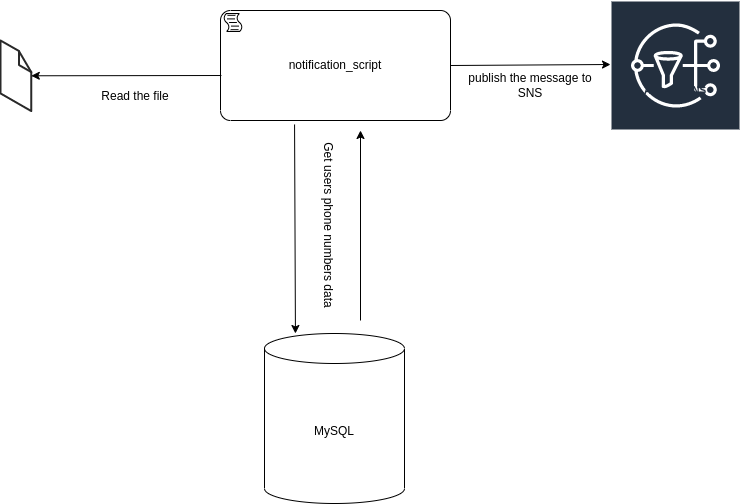

    
## Answers:

1. This code is a script that reads a text plain file, that file contains the *account_type* and *account_id* in each row. With that data the script find the user and phone in the database, currently it's using mysql. Then it build a message and publish it in a event in SNS of AWS for each of the phone numbers of the user.

2. I think is necessary to know which is the business process related with that scripts. And what are the not functional requirements like: 
    - Should the script fails when a user does not exists? should we validate that all the users exits before to start to send the notifications?
    - What will be the charge of the scritps? How much messages we are going to send. Is it a one time script or should run frequently.
    - Is there any reason to send the messages in a syn way? or is posible to improve the perfomance make it async?

3. Form my perpective I think the code have a lot of technical debt:
    - It's Spaghetti code, and it make difficult to tests it.
    - Also the code is not readable, the name of the funcions and the parameters is confuse.
    - All the code is coupled to mysql and SNS.
    - It makes the code unsustainable.
    - There are security issues like the posibility of SQL injections, security credentials harcoded in the code.
    - There are performance issues, we are doing 2 queries to database for each profile to notify.
    - There is a lot of repeated code, and anything is reusable.
    - There is not validation to avoid a critical error in the process.

4. It could be a one time script or a job executed frequenlty once a file was loaded to a server (by other system or with a manual upload), and it publish an event in SNS. That event should have some additional system suscribed to it maybe LambdaFuncions thats sends the message (text, whatsapp an automated call)to the phone number to the user with the notification.

That is the part of the flow that we can to know with the current code

